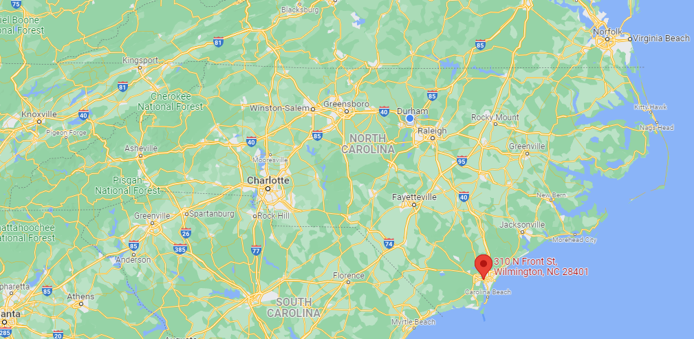
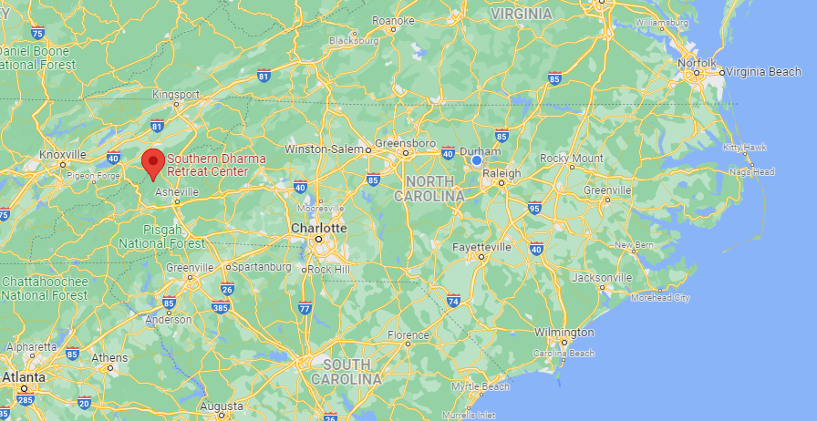
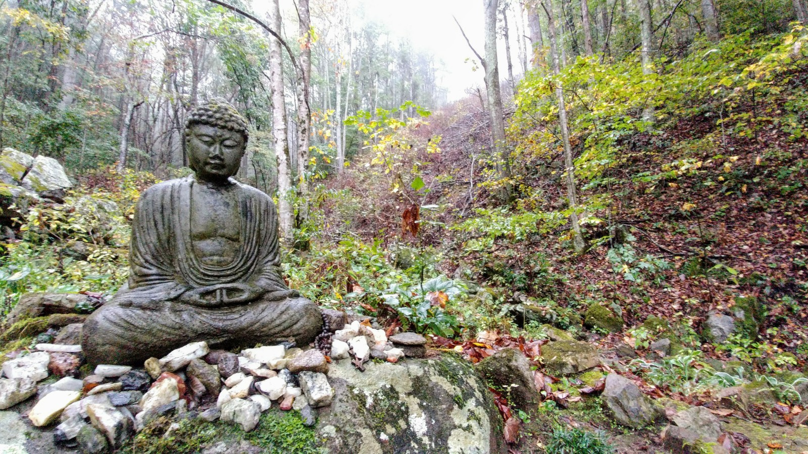
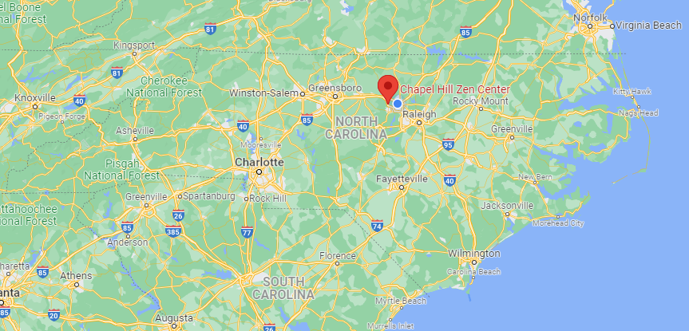
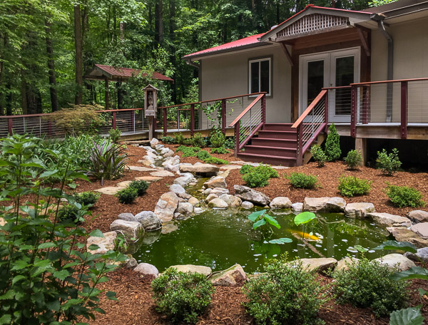

```{r setup, include=FALSE}
library(xaringanthemer)
style_duo_accent(
  primary_color = "#866fa3",
  secondary_color = "#F1DE67",
  inverse_header_color = "#464a53",
  black_color = "#464a53",
  header_font_google = google_font("Atkinson Hyperlegible"),
  text_font_google   = google_font("Atkinson Hyperlegible", "300", "300i"),
  code_font_google   = google_font("Source Code Pro"),
  title_slide_background_color = "#0C2340",
  title_slide_text_color = "white",
  title_slide_background_size = "contain",
  base_font_size = "26px",
  extra_css = list(
    "h1" = list("margin-block-start" = "0.4rem", 
                "margin-block-end" = "0.4rem"),
    "h2" = list("margin-block-start" = "0.4rem", 
                "margin-block-end" = "0.4rem"),
    "h3" = list("margin-block-start" = "0.4rem", 
                "margin-block-end" = "0.4rem"),
    ".small" = list("font-size" = "90%"),
    ".midi" = list("font-size" = "150%"),
    ".large" = list("font-size" = "200%"),
    ".xlarge" = list("font-size" = "600%"),
    ".hand" = list("font-family" = "'Gochi Hand', cursive",
                   "font-size" = "125%"),
    ".task" = list("padding-right"    = "10px",
                   "padding-left"     = "10px",
                   "padding-top"      = "3px",
                   "padding-bottom"   = "3px",
                   "margin-bottom"    = "6px",
                   "margin-top"       = "6px",
                   "border-left"      = "solid 5px #F1DE67",
                   "background-color" = "#F1DE6750")
  )
)
```

class: inverse

## Cape Fear Tibetan Buddhist Study Group

```{r echo=FALSE, out.width = "80%", fig.align = "center"}

```


.center[.hand[Wilmington, NC]]

---

## Cape Fear Tibetan Buddhist Study Group

#### Facts

- Established 2000
- Tibetan Buddhism
  - Especially Nyingma and Kagyu
- Resident Director: Randolph E. Clayton (Orgyen Sherab)


---

## Cape Fear Tibetan Buddhist Study Group

#### Lineage

- Tibetan Buddhism developed out of Vajrayāna traditions
  - Taught by the Buddha and bodhisattva Vajrapāni
  - Padmasambhāva and Śāntarakṣita were invited by Tibetan King
- Nyingma
  - Developed from the 8th century onwards in Tibet
  - The oldest Tibetan Buddhist tradition
- Kagyu
  - A newer tradition, founded 11th century
  - Marpa, Milarepa, Rechungpa, and Gampopa were influential in founding

---

## Cape Fear Tibetan Buddhist Study Group

#### Practice

- Services held Sundays and Wednesdays
  - Prostrations
  - Meditation
  - Discussions
- Organized trips to temples in state and region
  - Included trips to triangle and to Florida
- Were attempting to build a library of Dharma books

---

class: inverse

## Southern Dharma Retreat Center

```{r echo=FALSE, out.width = "80%", fig.align = "center"}

```


.center[.hand[Hot Springs, NC]]

---

## Southern Dharma Retreat Center

#### Facts

- Established in 1978
- Non-Sectarian
- Sonia Marcus is executive director
- Board of Directors Chairman: David Heckel
  - Pfieffer University
- Executive Director: Sonia Marcus
  - Jewish Buddhist

---

## Southern Dharma Retreat Center

#### Practice

- Offer meditation retreats
  - Intended to offer psychological benefits to attendees
  - Led by teachers from varying backgrounds
  - Some retreats require more experience
- Schedule
  - Many are over an extended weekend, some are week-long
  - Both at home and on-site retreats
- Retreat days
  - Sitting, working, walking meditation, yoga
  - Noble Silence & Five Precepts
- Residency
  - 6 to 8 weeks
  - Engage in practice & volunteer around the site

---

## Southern Dharma Retreat Center

```{r echo=FALSE, out.width = "80%", fig.align = "center"}

```

---

class: inverse

## Chapel Hill Zen Center

```{r echo=FALSE, out.width = "80%", fig.align = "center"}

```

.center[.hand[Chapel Hill, NC]]

---

## Chapel Hill Zen Center

#### Facts

- Established 1981
  - Group of friends meditating in homes
  - Several members practiced at San Francisco Zen Center
- Sōtō Zen
- Abbess: Josho Pat Phelan
- 450 ppl in 2006

---


## Chapel Hill Zen Center

#### From the Buddha to Sōtō Zen

- Bodhidharma was the 28th Patriarch of Buddhism
  - Line of descent from Gautama Buddha
- Six Chinese Patriarchs (or Ancestors)
  - Principle teachers of the Chan, succesors of Bodhidharma
- Shítóu Xīqiān
  - Direct successor to Six Chinese Patriarchs
- Caodong Buddhism
  - Founded by Dongshan Liangjie
- Sōtō Zen was established by Dōgen Zenji in 13th century
  - Studied Caodong Buddhism in China
  - Emphasized zazen and koan tradition in his teachings

---

## Chapel Hill Zen Center
#### Sōtō Zen's Spread to the West
- Shunryū Suzuki Rōshi was trained in Japanese Sōtō Zen monasteries
  - Learned to teach Zen meditation and English lecturing
  - Sent to minister Japanese-American immigrants, taught converts

--

#### Lineage of Josho Pat Phelan

- Ordained in 1977 by Zentatsu Richard Baker
  - Shunryū Suzuki Rōshi's successor
- Hoitsu Suzuki was also a predecessor
  - Ordained by Sojun Mel Weitsman, who was also ordained by Shunryū Suzuki Rōshi

---

## Chapel Hill Zen Center
#### Practice

- Meditation schedule
  - Weekday & Sunday mornings
  - Tuesday, Thursday evenings
  - Zazen, Kinhin (walking meditation), Sutra Chanting Service
  - In-person and online
  - Lectures on Sundays
  
---

## Chapel Hill Zen Center
#### Practice
- Other Offerings
  - Recovery group
  - Study group
  - PoC meditation group
  - Eco-Dharma group
  - Children's program
  - The Bodhisattva Ceremony
    - Renewal of vows and precepts with roots in ancient India
  - Suggested readings list
  - Chinese Calligraphy & Brush Painting


---

## Chapel Hill Zen Center

```{r echo=FALSE, out.width = "60%", fig.align = "center"}

```


